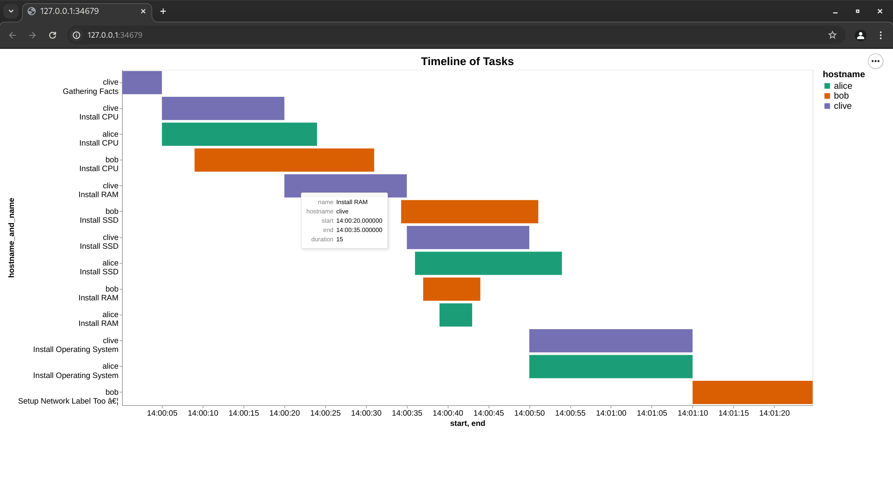

# Ansible Profile Visualiser

## Purpose.

To allow you to profile an ansible playbook and determine how long each task is taking, by analysing the JSON output of the `ansible-playbook` command while run with the profile tasks callback enabled.

### Example output.



## Example Usage.

- Merge the [ansible/ansible.cfg](ansible/ansible.cfg) into your `~/ansible.cfg` file, or copy it if you don't have one.

```shell
$ ansible-playbook <playbook> | tee out.json
$ apv --input out.json --show
```

## Usage.

- Put the contents of [ansible/ansible.cfg](ansible/ansible.cfg) into your ansible.cfg file. If you don't have one, you
can put this in the directory you run the playbook from.
- Run `ansible-playbook playbook.yaml | tee out.json`. This will run the playbook, outputting
to both the screen and the out.json file.
- Use `apv --input <filename> --show` to generate the timeline and display on a local browser.
- Use `apv --input <filename> --output <filename>` to generate an HTML file with the chart instead. 

---

# For developers.

## Dev packages

If you install this Python module with the dev packages, it will install a local copy of ansible.
This enables you to run the tests and work against a known good copy of Ansible.

If you are profiling an existing Ansible installation, you need to make sure you DO NOT install
these dev dependancies, or you will have one Ansible version in the venv, and another in the
context you should be working in.

## Bugs and Defects.

- It would be nicer to not have to find the json document in `out.json`, but ansible doesn't
seem to flexible in how it outputs the data. Not really a big deal as we can programmatically
extract the data from the output.
- Extracting JSON from the a`nsible-playbook | tee out.json` output is not robust. We just look for '{' and '}' characters.
- The dataclass Task has a pair of derived properties, but they are currently generated at init time to work with Pandas.
- The Y axis could be formatted nicer.
- Text formatting has wierd instances of `…` characters. Likely related to encoding. See [John Cook Post](https://www.johndcook.com/blog/2024/01/11/a-caret-euro-trademark/). Upstream patch send to the altair project.

## Generating the JSON.

- The dev packages install ansible, so you can generate your own JSON file with.

```bash
$ cd ansible
$ ansible-playbook playbook.yaml | tee out.json
```
